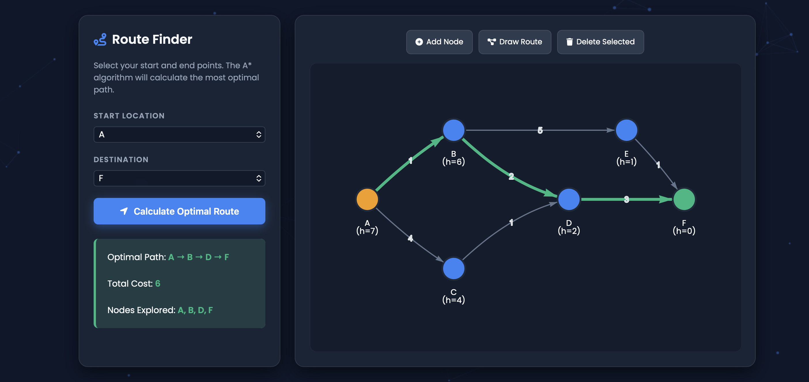

# AI Problem Solving Portfolio


This repository showcases advanced implementations of search algorithms and machine learning classifiers, featuring high-fidelity web interfaces and robust, Object-Oriented Python backends.

---
# 1) Route Finder Using A* Algorithm (Problem 11)

## Problem Description: 
A navigation system designed to find the fastest and most optimal route between a starting location and a destination within a city represented as a weighted graph.


**🌐 Live Interactive Demo:** https://narenkarthik10.github.io/AI_ProblemSolving_RA2411026050222_RA2411026050225/

---

## 📂 Repository Structure

```text
/
├── index.html                   # High-fidelity Interactive GUI for the Route Finder
├── python_models/               # Standalone Python algorithmic implementations
│   ├── route_finder.py          # A* Search algorithm (Console Application)
│   └── loan_prediction.py       # KNN Classification algorithm (Pure Python ML)
└── README.md                    # Project Documentation
```

## Algorithm Used: 
A* Search Algorithm. This informed search strategy computes the shortest path by calculating the actual travel cost from the start node g(n) and combining it with a heuristic estimation of the distance to the goal (h(n)).

## Key Features:Interactive GUI (index.html): 
Features a dynamic, glassmorphism-styled dashboard with an animated particle background. Uses vis.js to render an interactive node graph where users can dynamically add locations, draw roads, and calculate paths in real-time.

Console App (route_finder.py): Includes a dynamic map builder allowing users to define custom nodes, edges, and heuristics directly via the command line.

## Execution Steps:
Frontend: Visit the live demo link above. Select a Start and Goal node, or use the "Edit" tools to modify the map, then click Calculate Optimal Route.
Backend: Run python python_models/route_finder.py in your terminal. Choose option 1 for the default map or option 2 to build a custom graph via text input.

## Sample Output:



# 2) Loan Approval Prediction System - Classification Task (Problem 19)

**🌐 Live Interactive Demo:** https://devuharish002-alt.github.io/AI_ProblemSolving_RA2411026050222_RA2411026050225/loan.html

## 📂 Project Structure

```text
/
├── index.html                   # GPS Route Finder (A* Search) Interactive GUI
├── loan.html                    # Loan Predictor (KNN) Interactive GUI
├── python_models/               # Professional OOP Backend Implementations
│   ├── route_finder.py          # A* Search Logic (Problem 11)
│   └── loan_prediction.py       # KNN Classification Logic (Problem 19)
└── README.md                    # Documentation
```

## Algorithm:
K-Nearest Neighbors (KNN)The model classifies new applications based on their proximity to known historical data points in a multi-dimensional feature space.

## Feature Normalization:
All inputs (Income, Credit Score, Loan Amount) are normalized to ensure unbiased distance calculation.

## Euclidean Distance:
Proximity is determined using the norm (Euclidean distance) between feature vectors.

## Implementation
Frontend: A sleek, glassmorphism-themed dashboard featuring a dynamic particle-grid background and instant client-side inference.
Backend: A purely mathematical Python implementation without external dependencies, focusing on distance matrices and majority voting logic.

## Sample Output

