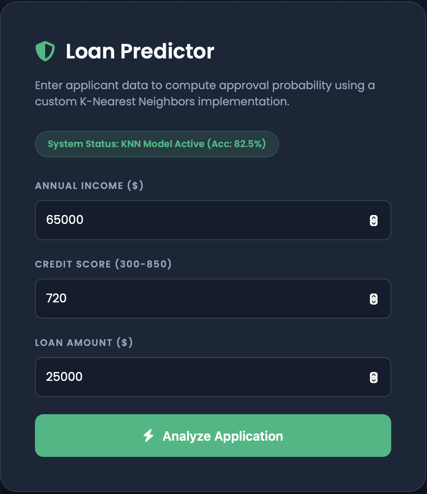

# AI Problem Solving Portfolio


This repository showcases advanced implementations of search algorithms and machine learning classifiers, featuring high-fidelity web interfaces and robust, Object-Oriented Python backends.

# 1) Loan Approval Prediction System - Classification Task (Problem 19)

**🌐 Live Interactive Demo:** https://devuharish002-alt.github.io/AI_ProblemSolving_RA2411026050222_RA2411026050225/loan.html

## 📂 Project Structure

```text
/
├── index.html                   # GPS Route Finder (A* Search) Interactive GUI
├── loan.html                    # Loan Predictor (KNN) Interactive GUI
├── python_models/               # Professional OOP Backend Implementations
│   ├── route_finder.py          # A* Search Logic (Problem 11)
│   └── loan_prediction.py       # KNN Classification Logic (Problem 19)
└── README.md                    # Documentation
```

## Algorithm:
K-Nearest Neighbors (KNN)The model classifies new applications based on their proximity to known historical data points in a multi-dimensional feature space.

## Feature Normalization:
All inputs (Income, Credit Score, Loan Amount) are normalized to ensure unbiased distance calculation.

## Euclidean Distance:
Proximity is determined using the norm (Euclidean distance) between feature vectors.

## Implementation
Frontend: A sleek, glassmorphism-themed dashboard featuring a dynamic particle-grid background and instant client-side inference.
Backend: A purely mathematical Python implementation without external dependencies, focusing on distance matrices and majority voting logic.

## Sample Output

